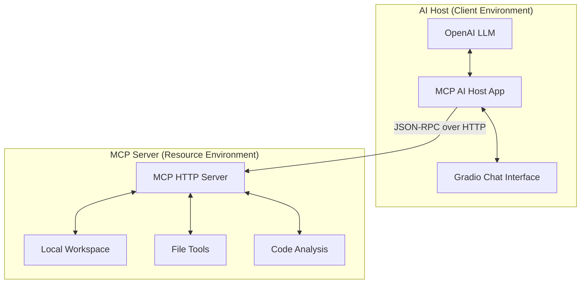
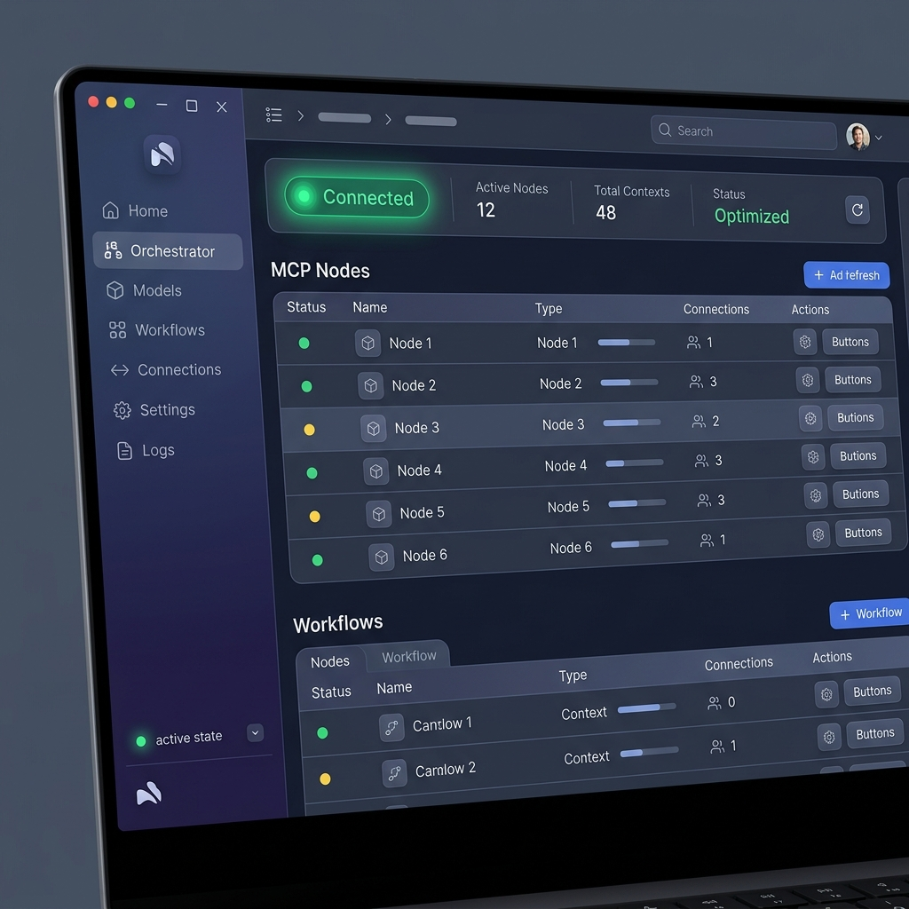
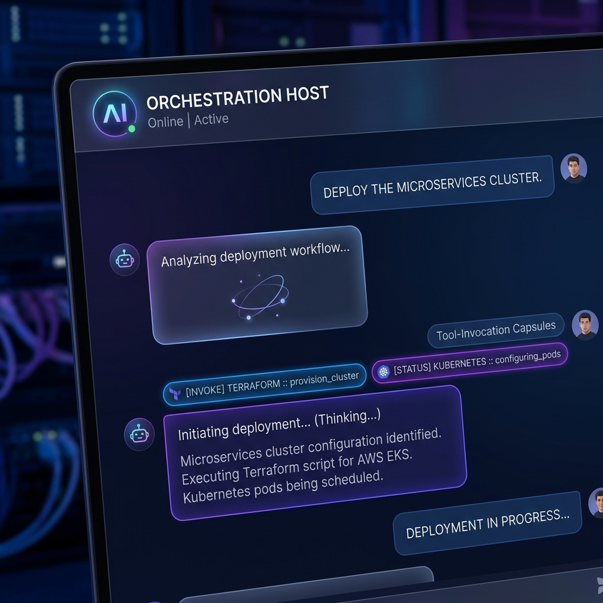

# 🌐 MCP Agent Orchestrator

[](https://modelcontextprotocol.io)
[](https://www.python.org/)
[](https://github.com/jlowin/fastmcp)
[](https://opensource.org/licenses/MIT)

A professional-grade orchestration suite for the **Model Context Protocol (MCP)**. This project demonstrates a robust remote HTTP architecture, featuring modular client/server implementations, advanced AI-driven tool discovery, and a premium developer experience.

---

## 🏗️ Architecture Overview

The system follows a classic **Distributed Tooling** pattern where the LLM (Host) and the Tools (Server) are decoupled via the Model Context Protocol over an HTTP transport layer.



---

## ✨ Key Features

### 📡 Remote MCP Protocol
- **Streamable HTTP**: Bidirectional communication between host and server.
- **Dynamic Discovery**: Automatic conversion of MCP tool schemas to OpenAI Function specifications.
- **Resource Templates**: Type-safe resource access using URI templates (e.g., `file://workspace/{filename}`).

### 🧠 Intelligent AI Host
- **Recursive Tool Use**: The AI can autonomously chain multiple tool calls to solve complex problems.
- **Protocol Helpers**: Synthetic tools that allow the AI to browse resources and list templates.
- **Message-Based UI**: A modern, premium chat interface with full history and tool-call visualization.

### 🛡️ Enterprise-Grade Security
- **Path Traversal Protection**: All file operations are strictly scoped to the `./workspace/` root.
- **Absolute Path Resolution**: Prevents `../` style attacks via recursive path resolution.

---

## 🚀 Quick Start

### 1. Prerequisites
- Python 3.10 or higher
- OpenAI API Key

### 2. Installation
```bash
# Clone the repository
git clone https://github.com/Mukkandi-Sridhar/mcp-orchestrator.git
cd mcp-orchestrator

# Setup environment
python -m venv venv
source venv/bin/activate  # Windows: venv\Scripts\activate
pip install -r mcp_advanced_lab/requirements.txt
```

### 3. Configuration
Create a `.env` file in the root directory:
```env
OPENAI_API_KEY=your_sk_...
```

### 4. Running the Ecosystem
**Start the Server:**
```bash
python mcp_advanced_lab/mcp_http_server.py
```

**Launch the Desktop Client (GUI):**
```bash
python mcp_advanced_lab/mcp_http_client_app.py http://127.0.0.1:8000 workspace
```

**Launch the AI Host (Chat):**
```bash
python mcp_advanced_lab/mcp_http_host_app.py http://127.0.0.1:8000 workspace
```

---

## 🖼️ Gallery

| Desktop Client (GUI) | AI Host (Chat) |
| :---: | :---: |
|  |  |

---

## 🛠️ Components Detail

| Component | Responsibility | Technology |
| :--- | :--- | :--- |
| **Server** | Resource exposure & tool execution | `FastMCP`, `Uvicorn` |
| **Base Client** | Protocol logic & session management | `mcp`, `httpx` |
| **Desktop App** | Human-in-the-loop tool discovery | `Gradio` |
| **AI Host** | LLM orchestration & autonomous actions | `OpenAI`, `Gradio` |

---

## 🗺️ Roadmap
- [ ] **Multi-Server Orchestration**: Connect a single host to multiple MCP servers simultaneously.
- [ ] **Local LLM Support**: Integration with Ollama/Llama.cpp for fully private workflows.
- [ ] **Auth Layer**: Add API Key / Bearer Token authentication to the HTTP server.

---

Built with ❤️ for the MCP Developer Community.
